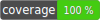

# ISO 4217 standard utilities



This component provides features for ISO 4217 standard - get currency codes according to standard.

## Installation

```php
composer require arslanimamutdinov/iso-standard-4217
```

## Terms and designations

- alpha3 - three-letter currency code e.g. RUB;
- numericCodes - numeric currency code e.g. 643;
- name - string currency name e.g. Russian ruble.